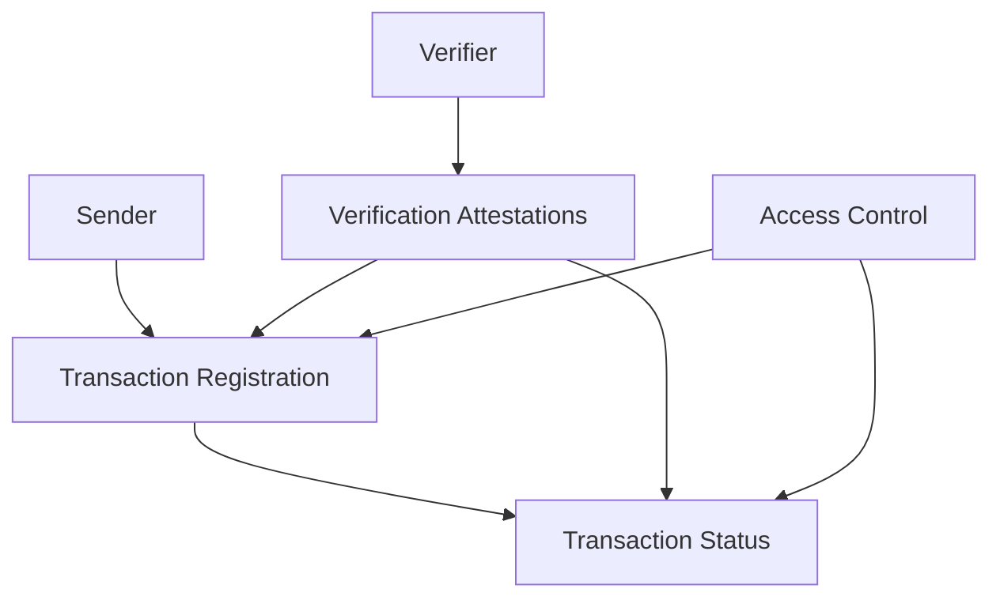

# Transaction Sentinel - Smart Contract Transaction Tracking & Verification

A blockchain-based solution for creating comprehensive, transparent, and verifiable transaction records on the Stacks blockchain. Transaction Sentinel enables real-time monitoring, verification, and access control for blockchain transactions.

## Overview

Transaction Sentinel provides a robust system for:
- Transaction registration and tracking
- Third-party transaction verification
- Detailed status monitoring
- Granular access control
- Immutable transaction history

The system serves multiple stakeholders:
- Developers can track complex transaction flows
- Compliance teams can verify transaction details
- Security professionals can monitor potential risks
- Regulators can audit blockchain interactions

## Architecture

The system is built on a single smart contract that manages interconnected data structures for transaction tracking.



Core components:
- Transaction registry
- Verification system
- Status tracking
- Access control layer

## Contract Documentation

### Data Structures

1. **Transactions Map**
   - Stores transaction details including sender, recipient, amount
   - Tracks transaction status and metadata
   - Indexed by transaction ID

2. **Verifiers Map**
   - Maintains authorized transaction verifiers
   - Specifies verification type and status
   - Indexed by verifier principal

3. **Verifications Map**
   - Records verification attestations
   - Links verifications to specific transactions
   - Indexed by verification ID

### Key Functions

#### Transaction Operations
```clarity
(define-public (register-transaction 
    (recipient principal) 
    (amount uint) 
    (token-type (string-ascii 50)) 
    (status (string-ascii 20)) 
    (additional-data (string-ascii 255))
))
(define-public (update-transaction-status 
    (transaction-id uint) 
    (status (string-ascii 20))
))
```

#### Verification Operations
```clarity
(define-public (register-verifier 
    (name (string-ascii 100)) 
    (verification-type (string-ascii 100))
))
(define-public (submit-verification 
    (transaction-id uint) 
    (status (string-ascii 20)) 
    (comments (string-ascii 255))
))
```

#### Access Control
```clarity
(define-public (grant-data-access 
    (data-type (string-ascii 20)) 
    (data-id uint) 
    (accessor principal) 
    (access-level (string-ascii 20))
))
(define-public (revoke-data-access 
    (data-type (string-ascii 20)) 
    (data-id uint) 
    (accessor principal)
))
```

## Getting Started

### Prerequisites
- Clarinet installed
- Stacks wallet for deployment
- Basic understanding of Clarity and Stacks blockchain

### Installation
1. Clone the repository
2. Install dependencies with Clarinet
3. Deploy contract to testnet or mainnet

### Basic Usage

1. Register a transaction:
```clarity
(contract-call? .transaction-monitor register-transaction 
    tx-sender     ;; recipient
    u1000         ;; amount
    "STX"         ;; token type
    "pending"     ;; status
    "transfer"    ;; additional data
)
```

2. Register as a verifier:
```clarity
(contract-call? .transaction-monitor register-verifier 
    "Compliance Validator" 
    "transaction-verification"
)
```

## Security Considerations

1. Access Control
   - All sensitive operations require appropriate authorization
   - Data access can be granularly controlled
   - Only registered verifiers can submit attestations

2. Data Validation
   - Input validation for all parameters
   - Proper error handling for invalid operations
   - Sequential ID generation for transactions and verifications

3. Verification System
   - Multiple verification types supported
   - Verification history is immutable
   - Transparent tracking of transaction statuses

## Development

### Testing
1. Run included test suite:
```bash
clarinet test
```

2. Deploy to testnet:
```bash
clarinet deploy --testnet
```

### Best Practices
- Always verify transaction sender authorization
- Maintain comprehensive transaction metadata
- Use appropriate error codes for failed operations
- Keep data fields within size limits
- Implement multi-level verification mechanisms